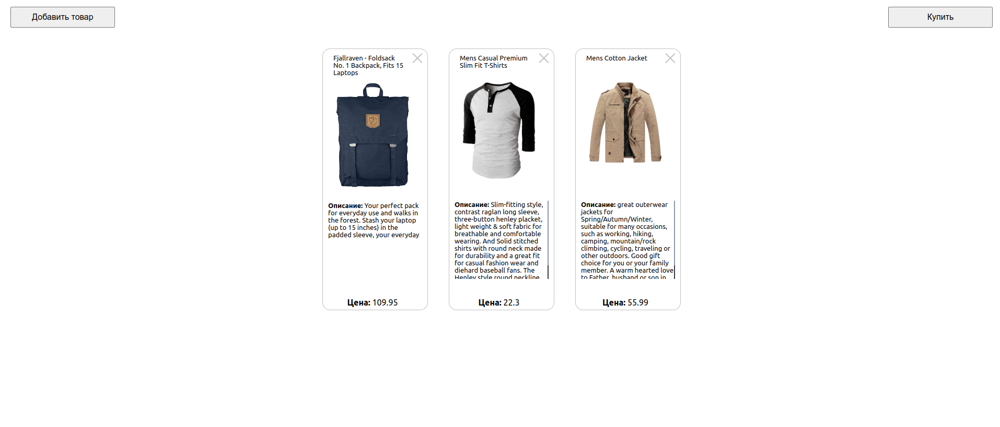

## Тестовое задание 

Нужно сделать приложение - список покупок:  

Реализация должна включать в себя использование:  

redux-thunk  
typescript  
sass  

Для запуска приложения введите комманду  `npm start` .

Так же можно попробовать по [ссылке](https://testshoplist.herokuapp.com/) .

